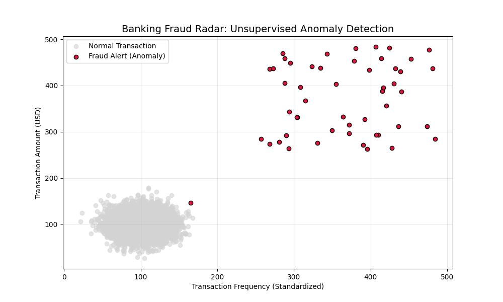

  

 # 🛡️ Financial Anomaly Radar: Unsupervised ML Approach
**By NovaClic Data | MSc. AI & BI Strategic Specialist**
  
  **Data Strategist | Financial Cybersecurity & Outlier Detection**
  
  
  

---

### 🕵️ Executive Summary
This project addresses the critical challenge of identifying fraudulent transactions in high-stakes financial environments. Using the **Isolation Forest** algorithm, the system isolates statistical outliers (anomalies) that traditional rule-based systems often overlook.

### 🔍 Engine Anomaly Detection Radar (Python Analysis)

*This visualization is the direct output of the Isolation Forest engine, isolating critical outliers (Crimson) from normal transactional flow.*

### 📊 Strategic Executive Dashboard (Power BI)

*   **Central KPI:** 93% Detection Reliability.
*   **Visual Strategy:** Time-based anomaly segmentation for executive decision-making.

### 🛠️ Tech Stack & Architecture
*   **Algorithm:** Isolation Forest (Unsupervised Outlier Detection).
*   **Engine:** Python 3.x (Scikit-Learn, Pandas, NumPy).
*   **Framework:** Agile Project Management (**Scrum**).
*   **Visualization:** Power BI & Matplotlib/Seaborn.

### 📈 Business & Strategic Impact
*   **Risk Hierarchy:** Automated threat classification (70-95+).
*   **Zero-Day Protection:** Detection of novel fraud patterns.
*   **ROI Focus:** Minimizing operational friction between raw data and executive response.

